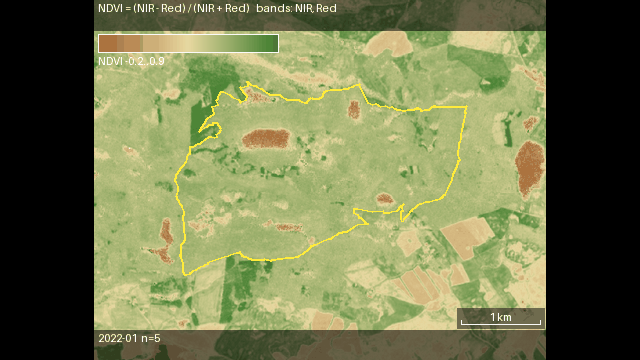
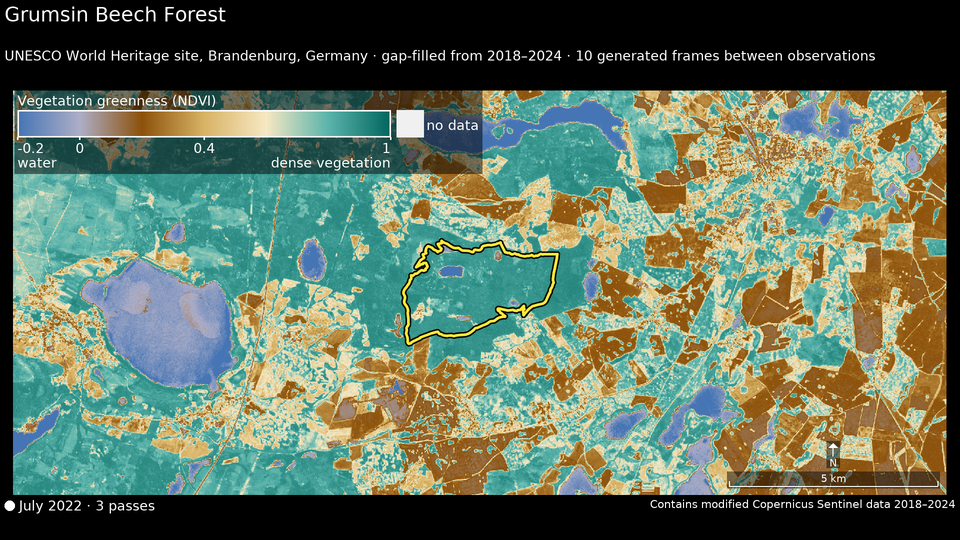
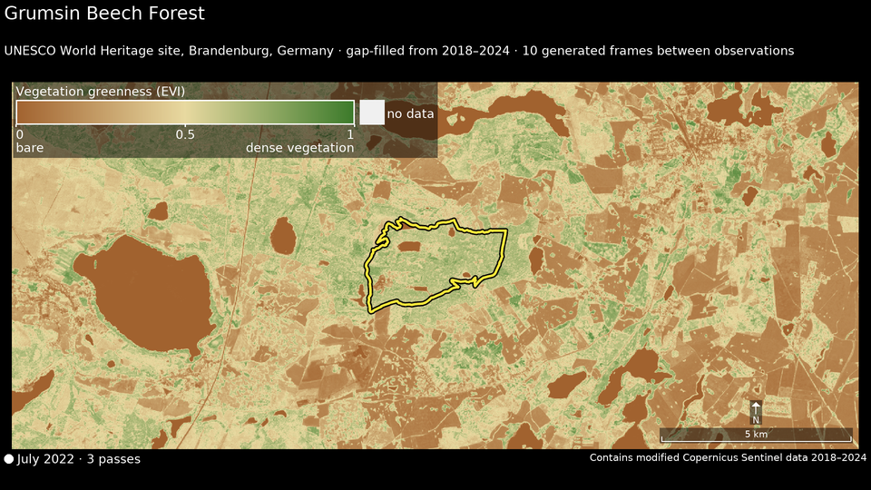
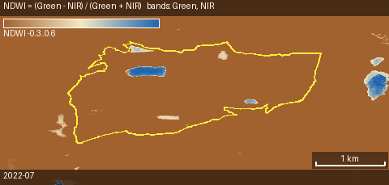
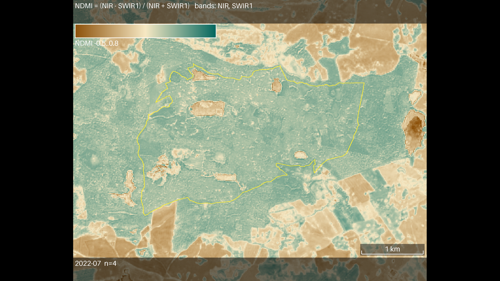
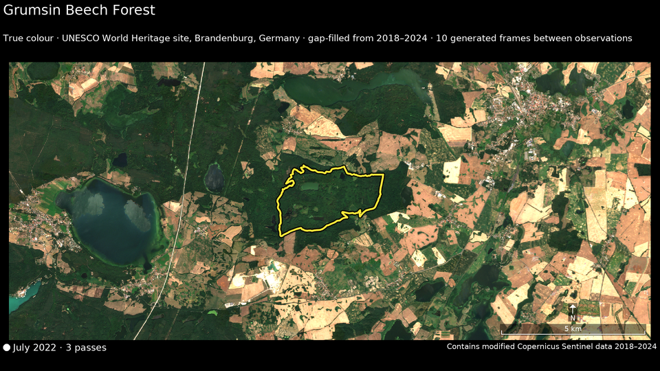
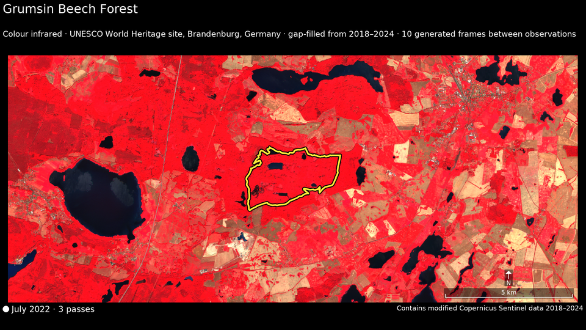
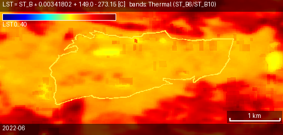
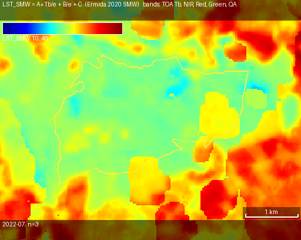
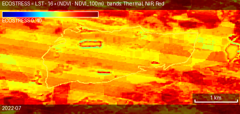

# Satellite Imagery Animation Generation

Generate annotated satellite index timelapses (MP4 + GIF) from Google Earth Engine
imagery (Sentinel-2 or Landsat), assembled frame-by-frame locally.

[](https://colab.research.google.com/github/cwinkelmann/GEE_Animation/blob/feat/evi-index/notebooks/colab_gee_animation.ipynb)

No local install needed — **[run it in Google Colab](https://colab.research.google.com/github/cwinkelmann/GEE_Animation/blob/feat/evi-index/notebooks/colab_gee_animation.ipynb)** (builds any index's animation + diagram from your browser).

## Install

Use the project's conda environment so the package and its dependencies land in
the right interpreter (the same one your Jupyter kernel uses):

```bash
conda activate GEE_animation
pip install -e ".[dev,notebook]"              # package + deps into this env
# add `shapefile` if you point AOIs at .shp files (pulls geopandas):
# pip install -e ".[dev,notebook,shapefile]"
earthengine authenticate                      # one-time; or the tool prompts on first run
```

Run the notebook (`notebooks/colab_gee_animation.ipynb`) with the `GEE_animation`
environment selected as the kernel — or open it directly in Colab via the badge above.

## Usage

```bash
cp config.example.yaml config.yaml   # edit AOI, dates, palette, fps
gee-animation --config config.yaml
```

Output is written to `out/<name>.mp4`, `out/<name>.gif`, and one annotated PNG
per month (`out/<name>_<YYYY-MM>.png`) so single frames can be reused on their own.

## Generate each index animation

Ready-to-run example configs (WNE AOI) live at the repo root. Run each with
`gee-animation --config <file>`; each writes `out/<basename>.mp4`, `.gif`, and one
PNG per month. Bands below are canonical roles (NIR/Red/Green/Blue/SWIR1/Thermal)
— each sensor maps them to its own bands (e.g. Sentinel-2 NIR = B8, Red = B4).

| Index | Sensor | How the value is calculated | Config (basename) |
|-------|--------|-----------------------------|-------------------|
| NDVI  | Sentinel-2 | `(NIR − Red) / (NIR + Red)` — vegetation greenness | `config.example.yaml` (`wne_ndvi`) |
| EVI   | Sentinel-2 | `2.5·(NIR − Red) / (NIR + 6·Red − 7.5·Blue + 1)` — enhanced vegetation | `config.evi.example.yaml` (`wne_evi`) |
| NDWI  | Sentinel-2 | `(Green − NIR) / (Green + NIR)` — open water (McFeeters) | `config.ndwi.example.yaml` (`wne_ndwi`) |
| NDMI  | Sentinel-2 | `(NIR − SWIR1) / (NIR + SWIR1)` — canopy/soil moisture | `config.ndmi.example.yaml` (`wne_ndmi`) |
| RGB   | any | true colour composite: R=Red, G=Green, B=Blue | `config.rgb.example.yaml` (`wne_rgb`) |
| CIR   | any | false-colour infrared: R←NIR, G←Red, B←Green (vegetation reads red) | `config.cir.example.yaml` (`wne_cir`) |
| LST   | Landsat | `ST_B × 0.00341802 + 149.0 − 273.15` °C — USGS C2 L2 ST band | `config.lst.example.yaml` (`wne_lst`) |
| LST (SMW) | Landsat | `A·Tb/ε + B/ε + C` — Ermida (2020) Statistical Mono-Window from TOA brightness temp, ASTER-GED emissivity ε, NCEP water vapour | `config.lst_smw.example.yaml` (`wne_lst_smw`) |
| LST-sharp | Landsat | `LST − 16·(NDVI − NDVI₁₀₀ₘ)` — NDVI-sharpened LST (approximation) | `config.lst_sharp.example.yaml` (`wne_lst_sharp`) |
| NDVI  | MODIS | `(NIR − Red) / (NIR + Red)` on MOD09A1 (500 m) | `config.modis.example.yaml` (`wne_modis_ndvi`) |

Two Landsat LST methods are available: `lst` = the USGS Collection-2 Level-2
Surface Temperature product (the pre-computed `ST_B*` band); `lst_smw` = the
Statistical Mono-Window algorithm of **Ermida et al. (2020)**. Both output °C and
typically agree within ~1–3 K.

`lst_sharp` is an NDVI-sharpened Landsat LST — an approximation, **not** the real
ECOSTRESS mission. (The real product, `NASA/ECOSTRESS/L2T_LSTE/V2`, *is* in Earth
Engine now, but only Los Angeles tiles are ingested as of 2026-07, and ECOSTRESS
rides the ISS — its coverage edge sits at ~53° N, right at this AOI's latitude, so
Grumsin would be edge-of-swath at best. Watch the EE catalog release notes for wider
ingest.)

Every frame is annotated: an info bar (top) with the formula and bands used, a
value colorbar (indices only), the region outline, a ground-distance scale bar,
and the month.

### Example frames

The full output in motion — a Sentinel-2 **NDVI timelapse** (monthly medians over
2022) of the WNE / Grumsin beech-forest AOI, showing spring green-up and autumn
senescence:

<p align="center"></p>

And one representative still frame per product (July 2022):

<table>
<tr>
<td align="center"><b>NDVI</b> (Sentinel-2)<br></td>
<td align="center"><b>EVI</b> (Sentinel-2)<br></td>
</tr>
<tr>
<td align="center"><b>NDWI</b> (Sentinel-2)<br></td>
<td align="center"><b>NDMI</b> (Sentinel-2)<br></td>
</tr>
<tr>
<td align="center"><b>RGB</b> true colour (Sentinel-2)<br></td>
<td align="center"><b>CIR</b> false-colour IR (Sentinel-2)<br></td>
</tr>
<tr>
<td align="center"><b>LST</b> USGS C2 L2 ST (Landsat)<br></td>
<td align="center"><b>LST (SMW)</b> Ermida 2020 (Landsat)<br></td>
</tr>
<tr>
<td align="center" colspan="2"><b>LST-sharp</b> NDVI-sharpened LST (Landsat)<br></td>
</tr>
</table>

Generate them all in one go:

```bash
for c in example evi.example ndwi.example ndmi.example rgb.example cir.example \
         lst.example lst_smw.example lst_sharp.example modis.example; do
  gee-animation --config "config.$c.yaml"
done
```

Any reflectance product (`ndvi`, `evi`, `ndwi`, `ndmi`, `rgb`, `cir`) runs on any
sensor — copy a config and change `sensor:` / `index:` (see Configuration). `lst`,
`lst_smw` and `lst_sharp` are Landsat-only.

## GUI (Gradio)

A simple web UI over the same pipeline — no config file needed:

```bash
pip install -e ".[gui,shapefile]"    # gradio (+ geopandas for shapefile uploads)
earthengine authenticate             # one-time
gee-animation-gui                     # or: python -m gee_animation.gui
```

Then in the browser: **upload an AOI** (GeoJSON or a zipped shapefile — this is
the cloud-filtered region), set a **frame buffer in metres** (the animation
extent is the AOI's bounding box expanded by this), pick a **sensor** and
**index** (choices update per sensor), a **date range** and cloud threshold, and
click *Generate*. The MP4 plays inline with a GIF download, a **frame gallery**
previews each month with a **ZIP of the single PNGs** to download, and a **region
time-series chart** (the index averaged over the AOI, one point per month) is
shown alongside it.

## Docker

Run the GUI in a container. Earth Engine auth is **not** interactive here, so use a
Google Cloud **service account** (the image ships no credentials of its own).

### 1. Service account (one-time)

Create the service account, grant it `serviceUsageConsumer` + `earthengine.writer`,
and download a key — see **[Service Account Setup](#service-account-setup)**. That
leaves the key at `key/ee-key.json`, used below.

### 2. Build

```bash
docker build -t gee-timelapse .
```

### 3. Run the GUI

Mount the key **read-only at runtime** (never baked into the image); optionally
mount an AOI to pre-load it:

```bash
docker run --rm -p 7860:7860 \
  -v "$PWD/key/ee-key.json:/secrets/ee-key.json:ro" \
  -v "$PWD/docs/aoi/wne/wne.geojson:/data/aoi.geojson:ro" \
  -e EE_SERVICE_ACCOUNT_KEY=/secrets/ee-key.json \
  -e EE_PROJECT=hnee-331218 \
  -e GEE_DEFAULT_AOI=/data/aoi.geojson \
  gee-timelapse
```

Open **http://localhost:7860**. Environment variables the container reads:

| Var | Purpose |
|-----|---------|
| `EE_SERVICE_ACCOUNT_KEY` | path to the mounted key (SA email read from it; override with `EE_SERVICE_ACCOUNT`) |
| `EE_PROJECT` | default Earth Engine project shown in the UI |
| `GEE_DEFAULT_AOI` | optional path (mounted) to pre-load as the AOI |
| `GRADIO_SERVER_NAME` / `GRADIO_SERVER_PORT` | bind host/port (default `0.0.0.0:7860`) |

**Local dev without a service account** — mount your existing credentials instead
and drop the service-account env vars:

```bash
docker run --rm -p 7860:7860 \
  -v "$HOME/.config/earthengine:/root/.config/earthengine:ro" gee-timelapse
```

## Configuration

See `config.example.yaml` (Sentinel-2 NDVI) or `config.lst.example.yaml` (Landsat LST). Key fields:

- **`aoi`** (area of interest) defines two geometries, each given as a `bbox`
  `[minLon, minLat, maxLon, maxLat]`, `geojson` (inline dict or file path), or
  `shapefile` (path to a `.shp`; auto-reprojected to EPSG:4326 — needs the
  `shapefile` extra, multiple features are dissolved into one):
  - **`frame`**: the animation extent (rectangle); aspect ratio is preserved when rendering.
  - **`region`**: the important region (polygon); only scenes where cloud coverage over this region is less than `region_max_cloud_percent` (default: 10%) are included, and its outline is drawn on each frame when `draw_region` is set.
- **`start`/`end`**: ISO dates (end exclusive).
- **`sensor`**: `sentinel2`, `landsat` (Collection-2 L2, missions 4/5/7/8/9 harmonized — ~1984→present), or `modis` (MOD09A1, 8-day 500 m).
- **`index`**: `ndvi`, `evi`, `ndwi` (McFeeters, open water), `ndmi` (moisture) — all sensors; or `lst` (USGS C2 L2 ST), `lst_smw` (Ermida et al. 2020 Statistical Mono-Window), or `lst_sharp` (Landsat only). `lst_sharp` is an NDVI-sharpened LST (an approximation — **not** the real ECOSTRESS mission; that product exists in EE as `NASA/ECOSTRESS/L2T_LSTE/V2` but is LA-only for now and its ISS orbit barely reaches this AOI's latitude).
- **`missions`** (optional; Landsat only): whitelist of missions, e.g. `[L8, L9]`. Thermal indices (`lst`, `lst_smw`, `lst_sharp`) default to **L8/L9** — Landsat 7's SLC-off gaps and the coarse TM/ETM+ thermal band otherwise stripe a few-scene median. Reflectance indices default to all missions (4/5/7/8/9).
- **`min_scenes`** (default `1`): minimum scenes per monthly median; months with fewer are skipped. Every frame is annotated with its scene count (`n=<count>`) — a median of 1–2 scenes says more about that morning's weather than the land, so raise this to reject thin composites.
- **`max_cloud_percent`**: scene-level pre-filter threshold (Sentinel-2/Landsat only; MODIS has no per-scene cloud metadata, so this is ignored and only the region filter applies).
- **`region_max_cloud_percent`**: region-level cloud filter (kept only if cloud over region < threshold).
- **`viz`** (optional; min/max/palette): fixed range for colorization so colour is comparable across frames. If omitted, per-index defaults apply (NDVI −0.2..0.9 green; EVI 0..1 green; NDWI −0.3..0.6 brown→blue; NDMI −0.5..0.8 brown→teal; LST 0..40°C thermal).
- **`render`** (fps/scale/dimensions/crs): rendering parameters. `render.crs` sets the output projection — omit for EPSG:4326 (plate carrée; at 53° N the x-axis is compressed by `cos(lat)`, so pixels are non-square), or set `auto` for the UTM zone from the AOI centroid (square pixels; the scale bar is then correct on both axes), or an explicit code like `EPSG:25833`.
- **`out_dir`**: output directory (default `out`).

Default GEE project is `hnee-331218`.

Each frame is a monthly cloud-masked median index composite, colorized with the
fixed `viz` range (or per-index default) so colour is comparable across frames, annotated with
the month label and a shared index colorbar. Cloud/no-data pixels are rendered in
a neutral grey rather than an index colour.

**Adding new sensors/indices:** register them in `gee_animation/products.py` (define a `Sensor` subclass and an `Index` function, then add both to the registry).

## Notes / limitations (v1)

- `render.dimensions` is capped to the product's **native resolution** so the
  render is never finer than the data (Landsat thermal 100 m, MODIS 500 m,
  Sentinel-2 10/20 m, Landsat reflectance 30 m); set `allow_upsample: true` to render
  finer anyway (a warning names the true native GSD). `render.scale` is informational.
- Sensors: Sentinel-2 and Landsat. One cadence (monthly) is supported; config
  is structured to add more.
- Sensors: Sentinel-2, Landsat, MODIS. Indices: NDVI, EVI, NDWI, NDMI (all
  sensors), LST, `lst_smw` and `lst_sharp` (Landsat only). Adding new indices/sensors
  requires registry changes in `products.py`.
- The `landsat` sensor spans **Collection-2 missions 4/5/7/8/9** (~1984→present):
  each mission's bands are renamed to a canonical set at collection build
  (TM/ETM+ `SR_B1–B5,B7` + `ST_B6`; OLI/TIRS `SR_B2–B7` + `ST_B10`), so every
  Landsat index runs across the whole record. Landsat 7 (post-2003 SLC-off) has
  wedge-shaped data gaps: over a few-scene monthly median these are **not** fully
  softened — the median's sample composition changes across a gap edge, which can
  print as banding in thermal composites. Prefer L8/L9-era dates for `lst`/`lst_smw`.
- `lst_sharp` approximates high-resolution LST by NDVI-guided thermal-sharpening of
  Landsat `ST_B10` — **not** the real ECOSTRESS mission (that product is in EE as
  `NASA/ECOSTRESS/L2T_LSTE/V2`, but LA-only for now and edge-of-coverage at this
  latitude). It injects native-30 m NDVI detail into the coarser thermal field using
  an empirical slope (`_LST_SHARP_NDVI_SLOPE` in `products.py`, tune to taste). A
  rigorous version would fit the slope per scene and add the coarse residual back
  (TsHARP/DisTrad).
- **MODIS is being decommissioned.** Terra & Aqua begin shutting down in late
  2026 / early 2027 (exact dates vary by NASA source — treat as imminent), and both
  platforms are already drifting from their designed orbits, shifting equatorial
  overpass times. A long MODIS loop therefore bakes a *moving overpass time* into its
  recent years — a real confound for a phenology animation. VIIRS is the successor.
- The region cloud filter averages only over the pixels a scene actually covers.
  A scene that clips a small clear corner of the region can still pass the
  `region_max_cloud_percent` threshold; use a region well inside the frame extent.
- Landsat LST has fewer scenes than Sentinel-2 NDVI; relax `region_max_cloud_percent`
  and widen the date window if "No images found" is reported.

## Development

```bash
pytest -m "not integration"          # fast unit tests (no network)
GEE_INTEGRATION=1 pytest -m integration   # live EE test (needs auth)
```

## Service Account Setup

For headless / containerized use (see [Docker](#docker)) Earth Engine
authenticates via a Google Cloud **service account** instead of the interactive
`earthengine authenticate` flow.

**Prerequisite:** the project must be registered for Earth Engine
(https://console.cloud.google.com/earth-engine).

Create the account, grant the two required roles, and download a key (with
`gcloud`, or the Cloud Console equivalents):

```bash
PROJECT=hnee-331218
gcloud iam service-accounts create gee-animation --project="$PROJECT" \
  --display-name="GEE Animation"
SA="gee-animation@$PROJECT.iam.gserviceaccount.com"

# 1) use the project's APIs
gcloud projects add-iam-policy-binding "$PROJECT" \
  --member="serviceAccount:$SA" --role="roles/serviceusage.serviceUsageConsumer"

# 2) Earth Engine read + rendering — getThumbURL needs earthengine.thumbnails.create,
#    which `writer` includes and `viewer` does not
gcloud projects add-iam-policy-binding "$PROJECT" \
  --member="serviceAccount:$SA" --role="roles/earthengine.writer"

# 3) download a JSON key into key/ (git- and docker-ignored)
mkdir -p key
gcloud iam service-accounts keys create key/ee-key.json --iam-account="$SA"
```

Point `EE_SERVICE_ACCOUNT_KEY` at the key and `auth.init` uses it automatically
(the account email is read from the key; override with `EE_SERVICE_ACCOUNT`).
Verify from the shell:

```bash
EE_SERVICE_ACCOUNT_KEY=key/ee-key.json python -c \
  "from gee_animation import auth; import ee; auth.init('hnee-331218'); print('EE ok:', ee.Number(1).getInfo())"
```

The roles map to the pipeline stages you hit in order — missing ones surface as
staged errors: *"…required permission to use project…"* (no
`serviceUsageConsumer`) → then *"earthengine.thumbnails.create denied"* (no
`writer`, which is needed to render frames).