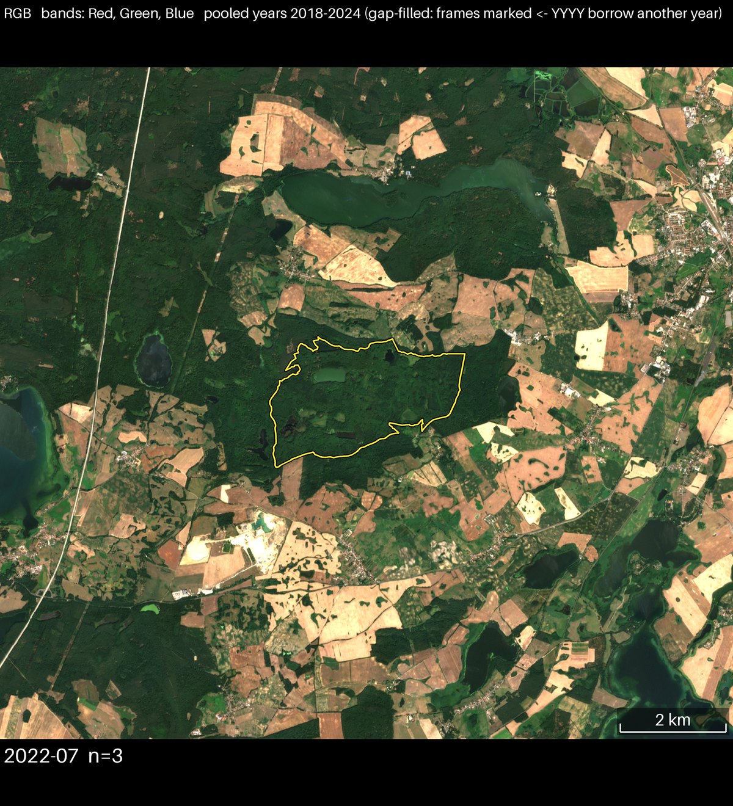
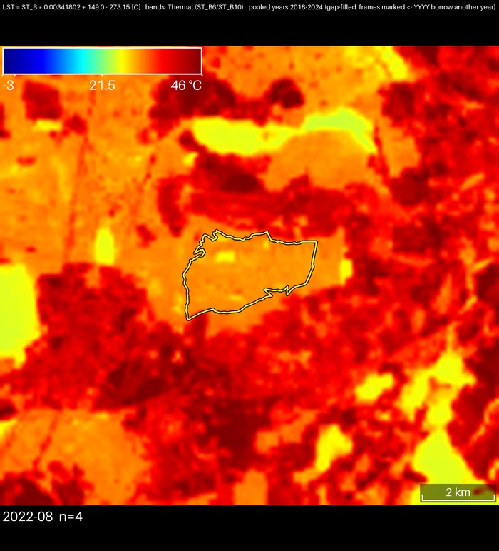
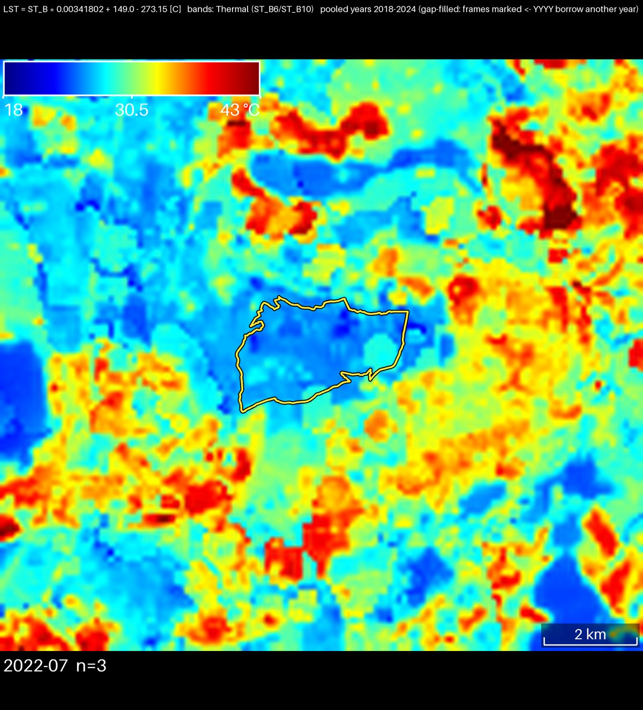
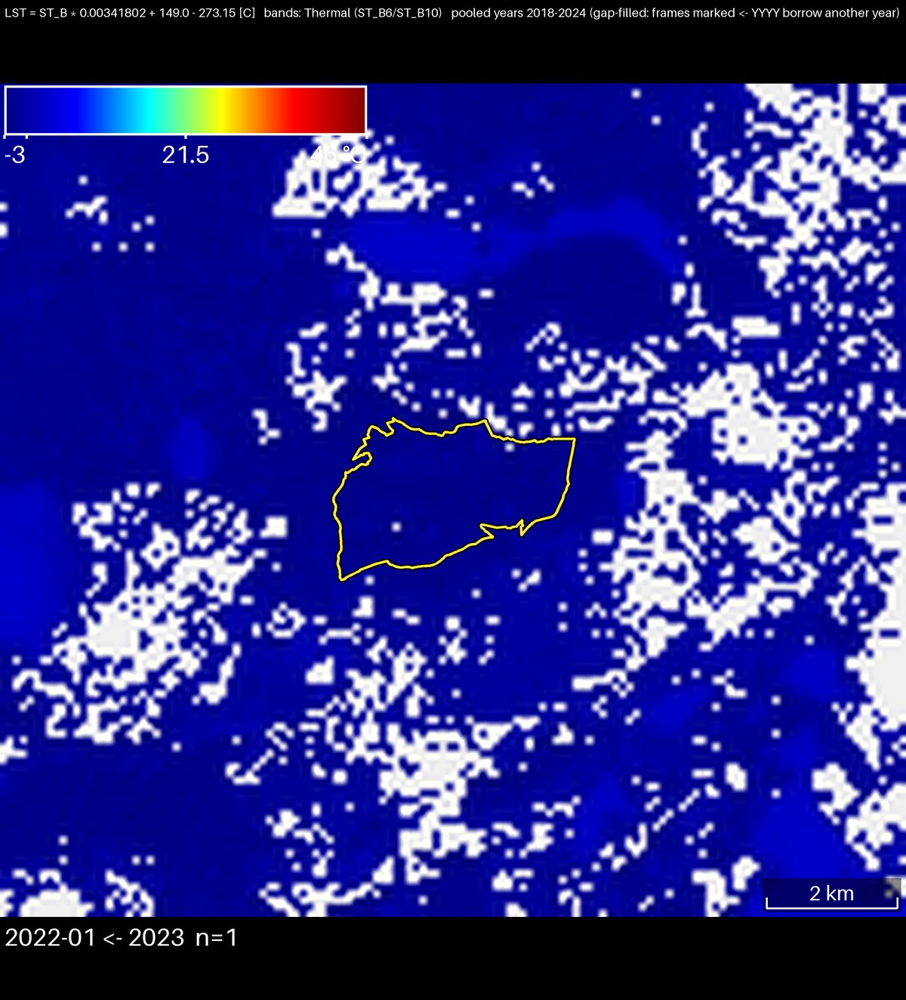
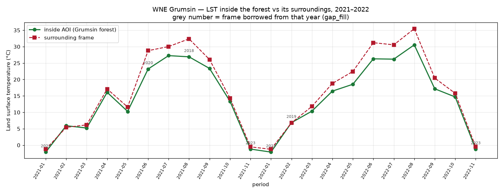

# How these time series are made

A walk through what happens between "a shapefile and a date range" and "an MP4",
written so a reader who is not going to open the code can still judge what the frames
do and do not show. Worked examples use the WNE / Grumsin beech forest AOI.

Status: first draft. Sections marked **TODO** are not written yet.

---

## 1. In one paragraph

For each time period in the requested range, the pipeline asks Earth Engine for every
satellite scene that overlaps the area, throws away the ones that are too cloudy,
combines what survives into a single image, downloads that image as a picture, draws
the labels and the colour bar onto it, and finally stitches the pictures into a video.
By default, nothing is interpolated between periods and nothing is smoothed over time:
every frame is built only from scenes actually acquired in its own period — with two
deliberate, opt-in exceptions: cross-year pooling (§6), and generated frames inserted
between observations for smoother playback (§7a).

---

## 2. The two areas

Two geometries are supplied, and they do different jobs:

| | role |
|---|---|
| **region** (`aoi.region`) | the thing being studied — the Grumsin forest polygon. Cloud cover is judged **over this polygon**, and it is what the yellow outline traces. |
| **frame** (`aoi.frame`) | the rectangle that becomes the picture. It is deliberately larger than the region so the forest can be compared against its surroundings. |

In the example configs the frame is the region buffered by 5 km, giving a 13.7 × 12.5 km
picture around a forest that is only 3.7 × 2.5 km.



*The area in true colour (Sentinel-2, July 2022). The yellow outline is the **region**;
everything around it is the **frame**. The forest is the dark continuous canopy; the
pale rectangles are harvested fields, and the surrounding villages, roads and lakes are
all resolvable at 10 m. This is the context the thermal comparison is made against.*

---

## 3. Choosing scenes: two cloud gates

Every candidate scene passes two independent tests. Both must pass.

1. **Scene-level** — the whole-scene cloud percentage that the data provider already
   publishes as metadata (`CLOUDY_PIXEL_PERCENTAGE` for Sentinel-2, `CLOUD_COVER` for
   Landsat), compared against `max_cloud_percent`. This is cheap and removes hopeless
   scenes early.
2. **Region-level** — the pipeline computes, per scene, the fraction of the **region
   polygon** that the scene's own cloud mask flags as cloudy, and compares it against
   `region_max_cloud_percent`.

The second gate is the one that matters. A scene can be 40 % cloudy overall and still be
useless if all of that cloud sits over the forest — and, conversely, a scene that is
cloudy at its edges can be perfect over the AOI.

### Worked example: why February 2022 has no image of its own

Every Landsat scene over the AOI in February 2022, with no filtering applied at all:

| date | mission | scene cloud | cloud over the forest | usable? |
|---|---|---|---|---|
| 2022-02-24 | L8 | 94.5 % | 100 % | no — scene cloud 94 % > 70 % |
| 2022-02-25 | L9 | 63.5 % | 100 % | no — region cloud 100 % ≥ 20 % |

Two scenes existed in the entire month, and both were completely clouded over the
forest. This is not a filtering artefact — there was no usable observation to keep.

You can produce this table for any run yourself:

```bash
gee-animation --config <your config> --inventory     # -> out/<name>_inventory.csv
```

It lists every candidate scene, both cloud figures, and a plain-language reason for
each rejection. This is the evidence to reach for when someone asks why a month is
missing or why the animation is not smoother.

---

## 4. Grouping into periods

`cadence` sets the bin width:

- `monthly` — calendar months.
- `semimonthly` — splits at the 1st and 16th.
- `10day` — splits at the 1st, 11th and 21st, so the last bin of a month is 8–11 days.

Bins are deliberately aligned to month boundaries and never cross them.

Finer cadence is not free. Sentinel-2 revisits every ~5 days, so 10-day bins usually
work; Landsat repeats every 16 days, so most 10-day Landsat bins are empty and the
pipeline warns about exactly that. A bin with fewer than `min_scenes` usable scenes is
skipped entirely rather than rendered thin — which is why frame counts are often lower
than the number of periods requested.

---

## 5. Building one frame from several scenes

Within a period the surviving scenes are cloud-masked per pixel and combined with a
**median**. The median is used rather than the mean because it is robust: a single
undetected cloud edge in one scene does not drag the value.

Pixels that are cloudy in *every* scene of the period have no value at all. They are
not guessed — they are painted neutral grey, so a viewer can see where there is no
observation. The `n=` figure drawn on each frame is how many scenes went into that
frame's median; `n=1` means no averaging happened and any residual cloud in that one
scene is in the picture.

---

## 6. Cross-year pooling (optional, off by default)

Set `pool_years` to let a period draw on the same calendar slot in other years. Three
strategies, and the difference between them matters:

| `pool_strategy` | what it does | is it a time series? |
|---|---|---|
| `gap_fill` | keeps the requested year wherever it has usable data; borrows another year **only** for periods that would otherwise be empty | mostly yes — unmarked frames are the requested year |
| `least_cloudy` | re-picks **every** period from whichever pooled year was clearest | no — a synthetic "typical" year |
| `median` | median across all pooled years for that period | no — blends years together |

Measured on the WNE summer loop: `least_cloudy` produced only 2 of 15 frames from the
requested year, `gap_fill` produced 10 of 15.

**Provenance is always drawn on the frame.** A borrowed frame is labelled
`2022-09 ← 2018`; a genuine frame carries just `2022-09`. The top information bar names
the pooled range and states which mode was used. If a frame has no arrow, it is real
data for the period shown.

Pooling is a cosmetic device for `least_cloudy` and `median`. Do not use those two for
trend detection, change detection, or anything reported as a measurement.

---

## 7. Turning the data into a picture

- **Projection.** Frames render in a metric UTM projection (`crs: auto`), so pixels are
  square and the scale bar is valid in both directions. The old default was plate
  carrée, which stretched this latitude horizontally by a factor of 1.66.
- **Fixed colour scale.** `viz.min`/`viz.max` are applied identically to every frame, so
  a colour means the same temperature throughout the animation. This is what makes
  frames comparable — and it is why one range cannot suit both winter and summer (§9).
- **Resolution is honest.** The renderer never invents detail: it fetches at the
  product's true ground resolution and upscales smoothly for display. Landsat thermal
  is 100 m, so a 13.7 km frame holds only ~137 real pixels; Sentinel-2 optical is 10 m
  and holds ~1368. That is a property of the sensors, not the tool.

  

  *The same frame in the thermal band. Compare with the true-colour image in §2: both
  cover identical ground, but this one contains roughly one tenth the detail in each
  direction. The softness is the data. `lst_sharp` will make this look sharper by
  fitting the thermal signal against 30 m optical, at the price of inventing structure —
  see §9.*
- **Overlays** — region outline, colour bar with units, scale bar, period label, and an
  information bar naming the bands and formula — are drawn *outside* the imagery, in
  added margins, so nothing in the picture is covered up.

---

## 7a. Interpolated playback (optional)

`render.interpolate: N` inserts N generated frames per one-period step, so an
animation reads as continuous motion instead of a slideshow. Spacing is
proportional: a two-month gap gets twice the generated frames of a one-month gap,
so playback speed tracks elapsed time rather than frame count — this matters
because periods get skipped (§3, §4), so a real run's gaps are not all one period
wide.

**Generated frames show dates that were never observed.** They are labelled
`2022-05 -> 2022-06  30%` and the info bar states the interpolation, so an
observed frame is never mistaken for a generated one. Observed frames are
byte-identical to a run with interpolation off — interpolation only adds frames,
it never touches a real one.

Two modes: `data` interpolates index values before colouring, so the colour bar
stays exactly valid; `crossfade` blends already-finished colour and is the only
option for the `rgb`/`cir` composites, which arrive from Earth Engine pre-coloured
with no index values left to interpolate — asking for `data` on a composite is
rejected at config load, naming `crossfade` as the fix. `auto` (the default)
resolves to `data` for single-band indices and `crossfade` for composites.

Where one observation has a cloud hole and the next does not, the generated frames
**hold the valid observation's value** rather than fading toward the no-data grey —
otherwise a healing cloud hole would pulse grey in and out on every transition.

Only observed frames get per-frame PNGs. `render.gif` defaults to off when
interpolating (several hundred quantized frames would be enormous) and on
otherwise; set `gif: true` explicitly to force it either way.

---

## 8. Recorded numbers, and plotting them

Set `metadata: true` and the run writes `out/metadata.db` (SQLite), one row per
**observed** frame — a generated frame (§7a) was never acquired, so it names no file
and gets no metadata row:

`name, sensor, index_name, month, n_scenes, aoi_cloud_fraction, aoi_clear_fraction, aoi_mean`

`aoi_mean` is the mean of the index over the AOI's **clear** pixels — °C for the thermal
products, NDVI for NDVI — so it is directly plottable as a time series.

Separately, `charts.inside_outside_timeseries` returns the mean **inside the region** and
**over the surrounding frame** for each period, which is the comparison that carries the
ecological story.

### The phenomenon, seen and measured

Worked example, the two-year Landsat LST run (`config/wne_2yr_gapfill.example.yaml`).
The forest is markedly cooler than the farmland around it while the canopy is active,
and indistinguishable from it in winter — a difference of about **4.7 °C in summer**
against **0.3 °C in winter**.



*July 2022, colour range narrowed to 18–43 °C. The forest reads as a coherent cool
island — green and cyan against farmland at 35–43 °C. Its boundary in the thermal image
follows the mapped polygon closely, which is the point: the canopy, not the map, is
what makes the temperature change. The small deep-blue patches elsewhere are lakes.*



*January 2022, from the two-year run. The forest is invisible — indistinguishable from
everything around it. This is the phenomenon being absent, not the imagery failing:
with no active canopy there is nothing to buffer. It also shows the fixed-range
trade-off of §9, since this frame occupies a few percent of a −3…46 °C ramp.*



*The same two years as a series: mean LST inside the forest (green) against the
surrounding frame (red). The two lines run together through winter and separate every
summer, by up to 5.6 °C. Grey numbers mark the five frames that `gap_fill` borrowed
from another year. No single frame shows this — it is the reason for building the
series at all.*

**Caveat:** `aoi_mean` is computed only over clear pixels, so a frame with heavy partial
cloud averages a smaller, non-random part of the AOI. Read the series alongside
`n_scenes` and `aoi_clear_fraction` from the same table.

---

## 9. Known limitations

- **One fixed colour range per animation.** Over a full year, January's whole-scene
  spread is under 3 °C while July's is ~17 °C, so any single range renders winter flat.
  Narrow the range and the season for contrast; widen it for a seasonal cycle.
- **Periods can be missing entirely.** Both Decembers are absent from the two-year
  Landsat run: no usable December scene exists in *any* year 2018–2024 at these
  thresholds.
- **`n=1` frames are single observations**, not composites, and carry whatever cloud the
  detector missed.
- **`lst_sharp` is an approximation.** It sharpens 100 m thermal against 30 m optical
  and can produce blocky artefacts at the thermal block edges. The examples use plain
  `lst` for this reason.
- **Uneven time spacing.** With interpolation off (the default), skipped periods are
  dropped, not held, so a constant frame rate does not represent constant time. §7a's
  `render.interpolate` addresses this directly — proportional generated frames make
  playback speed track elapsed time — at the cost of the generated frames being
  synthetic, not observed.
- **The NDVI water stop is not a water mask.** Negative NDVI renders blue and positive
  NDVI renders on the brown-to-green land ramp, with the transition sitting close to
  zero (brown by NDVI~0.03) — but turbid or vegetated water with slightly positive NDVI
  still renders brownish, same as dry land. Distinguishing water from land reliably
  needs a second band (e.g. NDWI) through the fetch path, which is out of scope.

---

## 10. Reproducing the examples

```bash
gee-animation --config config/wne_2yr_gapfill.example.yaml     # 2 years, gap-filled LST
gee-animation --config config/wne_summer_pooled.example.yaml   # cosmetic summer loop
gee-animation --config config/wne_interpolated.example.yaml    # smooth playback (§7a)
gee-animation --config <cfg> --inventory                       # the scene evidence table
```

---

## TODO

- Per-sensor table of native resolution, revisit interval and available date range.
- How the anomaly modes (`climatology`, `reference`) work — not covered above.
- A worked NDVI example alongside the LST one in §8.
- Guidance on choosing `viz` ranges per index, with the percentile method used here.
